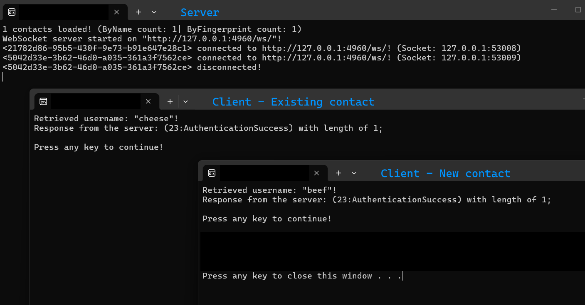

 
# ShadowWire
Because privacy isn't just a feature.

---
### Legal Disclaimer
- **Do not use this tool for illegal activities.** This includes (but is not limited to) harassment, threats, fraud, or distributing illegal content.
- **You are solely responsible** for your actions and compliance with all applicable laws.
- **No liability:** The developers and contributors of ShadowWire are not responsible for misuse. This project is provided "as-is," without warranty.

---
## Vision 
I saw a trend.
Privacy, eroded to pave the way for surveillance states, all masked under the banner of "safety".
Never knowing if an app is really using End-to-End-Encryption, or if it is all a lie.  
That is why I built ShadowWire, *because privacy isn't just a feature*, it's a right.

I have always been passionate about cryptography and cybersecurity.
This created the perfect experimentation platform to test zero-knowledge and zero-trust systems, as well as attack detection and more.

ShadowWire is my answer.

**What's yours?**

### Who is this even for?
- **Missionaries**, **Activists**, and **Journalists**, to people where privacy means the difference between life and death.
- **Cybersecurity enthusiasts** who want to poke, prod, and explore secure systems.
- **Anyone** who's ever asked, "Is this *really* private?"

### Why should you care?
You might be thinking, "I don't have anything to hide", why should I care?

This isn’t about hiding. It’s about **choosing who gets to listen**.

*(And how else are we going to communicate when the [singularity](https://en.wikipedia.org/wiki/Technological_singularity) hits?)*

### What this isn't:
- **A free pass for harm.** Privacy is a shield, not a weapon.
- **Perfect.** Security is an arms race; to improve, we have to break it first.
  As this is an experimental platform, and for transparency, we ***will*** maintain a companion repository that will lag behind this one, containing proof of concepts for various attacks and disruptions.

### Why the name ShadowWire?
`Shadow` isn't meant to mean darkness and thus illicit activities. But better characterised by translation of [the Old English word Sceadwian, which can mean to obscure, or to provide protection.](https://www.etymonline.com/word/shadow) 
`Wire` referencing communication.

Thus, ShadowWire actually means **protected communication**.

## Current state 
- Basic authentication implemented.
- Server handles multiple client sessions.

## Quick Start
***Coming soon!***
## Planning Features
***Coming soon!***